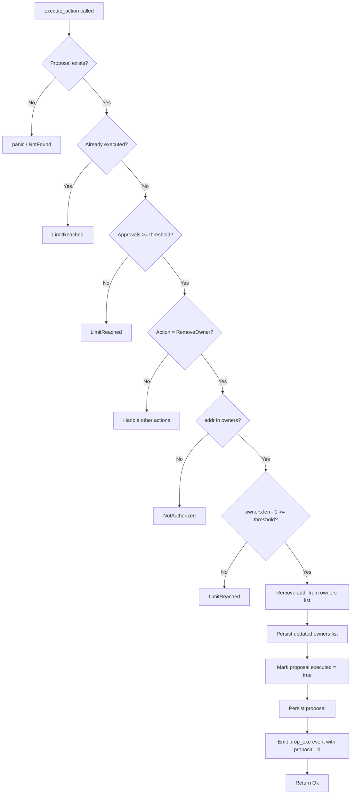

# Design Document: Multisig Owner Removal Safety

## Overview

This feature hardens the `RemoveOwner` execution path in the `RevoraRevenueShare` Soroban smart contract.
The existing implementation guards against dropping below the threshold in the happy path, but several
security-critical edge cases are unaddressed. This design adds:

- Existence validation at execution time (not proposal time)
- Atomic threshold invariant enforcement
- Self-removal safety (delegated to the same execution-time check)
- Duplicate/stale proposal protection
- Deterministic `prop_exe` event emission after successful removal
- Read-only query functions for owner set and threshold
- Comprehensive property-based and unit test coverage

The contract is a Soroban/Rust smart contract on Stellar. All state is stored in the contract's
persistent ledger storage using typed `DataKey` variants. There is no off-chain component; safety
guarantees are enforced entirely on-chain.

---

## Architecture

The feature is entirely contained within the existing `RevoraRevenueShare` contract. No new contracts,
cross-contract calls, or external dependencies are introduced.



### Key Design Decisions

1. **Execution-time checks only**: Both the existence check and the threshold invariant are evaluated
   when `execute_action` is called, not when the proposal is created. This correctly handles concurrent
   proposals (e.g., two proposals targeting the same owner — the second will fail with `NotAuthorized`
   after the first executes).

2. **No threshold auto-adjustment**: When an owner is removed, the threshold is left unchanged. If the
   remaining owner count equals the threshold, the multisig still operates (all remaining owners must
   agree). Threshold changes require a separate `SetThreshold` proposal.

3. **Event emitted after persistence**: The `prop_exe` event is emitted only after both the updated
   owners list and the executed proposal have been persisted, ensuring off-chain indexers see a
   consistent state.

4. **`LimitReached` for threshold violations, `NotAuthorized` for non-existent owner**: These error
   codes match the existing contract conventions and allow callers to distinguish between "the target
   is not an owner" vs "the removal would break quorum".

---

## Components and Interfaces

### Storage Keys

```rust
pub enum DataKey {
    MultisigOwners,       // Vec<Address>
    MultisigThreshold,    // u32
    MultisigProposal(u64), // Proposal
    // ... existing keys
}
```

### Data Types

```rust
pub struct Proposal {
    pub id: u64,
    pub action: ProposalAction,
    pub approvals: Vec<Address>,
    pub executed: bool,
}

pub enum ProposalAction {
    RemoveOwner(Address),
    AddOwner(Address),
    SetThreshold(u32),
    // ... other variants
}
```

### Error Variants Used

| Error                        | Meaning in this feature                                                                                          |
| ---------------------------- | ---------------------------------------------------------------------------------------------------------------- |
| `RevoraError::NotAuthorized` | Target address is not in the current owners list                                                                 |
| `RevoraError::LimitReached`  | Removal would violate `threshold ≤ owners.len()` invariant, or proposal already executed, or caller not an owner |

### Public Interface Changes

#### New read-only functions

```rust
/// Returns the current list of multisig owners, or an empty Vec if not initialized.
pub fn get_multisig_owners(env: Env) -> Vec<Address>;

/// Returns Some(threshold) if initialized, None otherwise.
pub fn get_multisig_threshold(env: Env) -> Option<u32>;
```

#### Modified function: `execute_action`

The `RemoveOwner` branch gains two new pre-execution guards (in order):

1. **Existence check**: `if !owners.contains(&addr) { return Err(RevoraError::NotAuthorized); }`
2. **Threshold invariant**: `if (owners.len() - 1) < threshold { return Err(RevoraError::LimitReached); }`

After both checks pass:

1. Remove `addr` from `owners`
2. Persist updated `owners` to `MultisigOwners`
3. Set `proposal.executed = true`
4. Persist `proposal` to `MultisigProposal(id)`
5. Emit `prop_exe` event with `proposal.id` as data

#### Existing functions (unchanged signatures)

```rust
pub fn propose_action(env: Env, proposer: Address, action: ProposalAction) -> Result<u64, RevoraError>;
pub fn approve_action(env: Env, approver: Address, proposal_id: u64) -> Result<(), RevoraError>;
pub fn execute_action(env: Env, proposal_id: u64) -> Result<(), RevoraError>;
pub fn get_proposal(env: Env, proposal_id: u64) -> Option<Proposal>;
```

---

## Data Models

### MultisigOwners

- **Storage key**: `DataKey::MultisigOwners`
- **Type**: `Vec<Address>`
- **Invariant**: After any successful `RemoveOwner` execution, `len >= 1` and `len >= threshold`.
- **Mutation**: Only via executed `AddOwner` or `RemoveOwner` proposals.

### MultisigThreshold

- **Storage key**: `DataKey::MultisigThreshold`
- **Type**: `u32`
- **Invariant**: `threshold >= 1` and `threshold <= len(MultisigOwners)` at all times after initialization.
- **Mutation**: Only via executed `SetThreshold` proposals.

### Proposal

- **Storage key**: `DataKey::MultisigProposal(id)`
- **Type**: `Proposal { id, action, approvals: Vec<Address>, executed: bool }`
- **Invariant**: Once `executed = true`, the proposal is never re-executed.
- **Mutation**: `approvals` grows via `approve_action`; `executed` flips to `true` via `execute_action`.

### Execution Flow State Transitions

```
Proposal created (executed=false, approvals=[proposer])
  → approve_action called N times (approvals grows)
  → execute_action called:
      [guards pass]
      → owners list updated in storage
      → proposal.executed = true, persisted
      → prop_exe event emitted
      → Ok(())
```

---

## Correctness Properties

_A property is a characteristic or behavior that should hold true across all valid executions of a system — essentially, a formal statement about what the system should do. Properties serve as the bridge between human-readable specifications and machine-verifiable correctness guarantees._

### Property 1: Non-Existent Owner Removal Fails

_For any_ owner list and any address that is not a member of that list, calling `execute_action` for a
`RemoveOwner(addr)` proposal targeting that address SHALL return `RevoraError::NotAuthorized`.

This covers the case where the address was never an owner, as well as the case where a prior proposal
already removed the address (duplicate/stale proposal protection).

**Validates: Requirements 1.1, 4.1**

---

### Property 2: Successful Removal Round-Trip

_For any_ owner list containing at least one address `addr`, where `len(owners) - 1 >= threshold`,
after a `RemoveOwner(addr)` proposal is successfully executed:

- `addr` SHALL NOT appear in the result of `get_multisig_owners`
- `len(get_multisig_owners())` SHALL equal `len(original_owners) - 1`

**Validates: Requirements 1.2, 6.3**

---

### Property 3: Threshold Violation Returns LimitReached

_For any_ owner list and threshold where `len(owners) - 1 < threshold`, calling `execute_action` for
a `RemoveOwner(addr)` proposal SHALL return `RevoraError::LimitReached`.

This includes the edge case where `len(owners) == 1` (removing the last owner always fails because
`0 < threshold` for any valid threshold ≥ 1).

**Validates: Requirements 2.1, 2.4, 3.1**

---

### Property 4: Post-Removal Threshold Invariant

_For any_ successful `RemoveOwner` execution, the resulting state SHALL satisfy:
`threshold <= len(get_multisig_owners())` and `len(get_multisig_owners()) >= 1`.

This is the global safety invariant: the multisig is always operable after any successful removal.

**Validates: Requirements 2.2, 9.1, 9.2**

---

### Property 5: Threshold Unchanged After Removal

_For any_ successful `RemoveOwner` execution, the value returned by `get_multisig_threshold()` SHALL
be identical before and after the execution.

**Validates: Requirements 9.3**

---

### Property 6: Event Emission Correctness

_For any_ successful `RemoveOwner` execution with proposal ID `pid`, the contract's event log SHALL
contain exactly one event with topic `prop_exe` and data `pid`.

_For any_ failed `RemoveOwner` execution (whether due to `NotAuthorized` or `LimitReached`), the
contract's event log SHALL NOT contain a `prop_exe` event.

**Validates: Requirements 5.1, 5.2, 5.3**

---

### Property 7: Executed Proposal Cannot Be Re-Executed

_For any_ proposal that has been successfully executed (i.e., `proposal.executed == true`), calling
`execute_action` again with the same proposal ID SHALL return `RevoraError::LimitReached`.

After execution, `get_proposal(id)` SHALL return `Some(proposal)` with `executed == true`.

**Validates: Requirements 8.1, 8.2**

---

### Property 8: Non-Owner Auth Rejection

_For any_ address that is not present in `MultisigOwners`, calling `propose_action` or `approve_action`
with that address SHALL return `RevoraError::LimitReached` (and SHALL NOT mutate any state).

**Validates: Requirements 7.1, 7.2**

---

## Error Handling

| Scenario                                                 | Error Returned      | Notes                                   |
| -------------------------------------------------------- | ------------------- | --------------------------------------- |
| `RemoveOwner(addr)` where `addr` not in owners           | `NotAuthorized`     | Checked at execution time               |
| `RemoveOwner(addr)` where `len - 1 < threshold`          | `LimitReached`      | Checked after existence check           |
| `RemoveOwner(addr)` where `len == 1`                     | `LimitReached`      | Special case of above (`0 < threshold`) |
| `execute_action` on already-executed proposal            | `LimitReached`      | Checked before action dispatch          |
| `execute_action` on proposal with insufficient approvals | `LimitReached`      | Checked before action dispatch          |
| `propose_action` by non-owner                            | `LimitReached`      | Checked after `require_auth`            |
| `approve_action` by non-owner                            | `LimitReached`      | Checked after `require_auth`            |
| `get_proposal` with unknown ID                           | Returns `None`      | Not an error                            |
| `get_multisig_owners` when uninitialized                 | Returns empty `Vec` | Not an error                            |
| `get_multisig_threshold` when uninitialized              | Returns `None`      | Not an error                            |

### Guard Order in `execute_action` for `RemoveOwner`

The guards MUST be evaluated in this order to produce deterministic, auditable errors:

1. Proposal exists (panic if not — storage invariant)
2. `proposal.executed == false` → else `LimitReached`
3. `proposal.approvals.len() >= threshold` → else `LimitReached`
4. `owners.contains(&addr)` → else `NotAuthorized`
5. `(owners.len() - 1) >= threshold` → else `LimitReached`
6. Mutate state, emit event, return `Ok(())`

---

## Testing Strategy

### Dual Testing Approach

Both unit tests and property-based tests are required. They are complementary:

- Unit tests cover specific examples, integration points, and edge cases
- Property-based tests verify universal correctness across randomized inputs

### Property-Based Testing

**Library**: [`proptest`](https://github.com/proptest-rs/proptest) (Rust crate, well-supported in `no_std`-adjacent environments; compatible with Soroban test harness via `soroban-sdk` test utilities).

**Configuration**: Each property test MUST run a minimum of 100 iterations.

**Tag format**: Each test MUST include a comment:
`// Feature: multisig-owner-removal-safety, Property N: <property_text>`

Each correctness property MUST be implemented by exactly one property-based test:

| Property                                     | Test Name                             | Proptest Strategy                                                                |
| -------------------------------------------- | ------------------------------------- | -------------------------------------------------------------------------------- |
| P1: Non-existent owner removal fails         | `prop_remove_nonexistent_owner_fails` | Generate random `Vec<Address>` (len 1–10) and random `Address` not in list       |
| P2: Successful removal round-trip            | `prop_removal_round_trip`             | Generate `(owners, threshold)` where `len-1 >= threshold`, pick random member    |
| P3: Threshold violation returns LimitReached | `prop_threshold_violation_fails`      | Generate `(owners, threshold)` where `len-1 < threshold`                         |
| P4: Post-removal threshold invariant         | `prop_post_removal_invariant`         | Generate all valid `(owners, threshold)` pairs, execute removal, check invariant |
| P5: Threshold unchanged after removal        | `prop_threshold_unchanged`            | Generate valid removal scenario, compare threshold before/after                  |
| P6: Event emission correctness               | `prop_event_emission`                 | Generate both success and failure scenarios, inspect event log                   |
| P7: Executed proposal cannot be re-executed  | `prop_no_double_execution`            | Generate any valid proposal, execute it, attempt re-execution                    |
| P8: Non-owner auth rejection                 | `prop_non_owner_rejected`             | Generate `(owners, non_member)` pairs, attempt propose and approve               |

### Unit Tests

Unit tests focus on specific examples, boundary conditions, and integration scenarios:

| Test Name                                   | Covers                                             | Type                   |
| ------------------------------------------- | -------------------------------------------------- | ---------------------- |
| `test_remove_owner_success`                 | Basic happy path removal                           | Example                |
| `test_remove_last_owner_fails`              | Single-owner list, threshold=1                     | Edge case (Req 2.4)    |
| `test_remove_owner_at_threshold_boundary`   | `len-1 == threshold` succeeds                      | Edge case (Req 2.2)    |
| `test_remove_nonexistent_owner`             | Address never in list                              | Example (Req 1.1)      |
| `test_duplicate_removal_proposal`           | Two proposals, same target                         | Example (Req 4.1)      |
| `test_self_removal_success`                 | Owner removes themselves, quorum intact            | Edge case (Req 3.2)    |
| `test_self_removal_fails_quorum`            | Owner removes themselves, would break quorum       | Edge case (Req 3.1)    |
| `test_propose_self_removal_allowed`         | Proposal creation succeeds for self-removal        | Example (Req 3.3)      |
| `test_event_emitted_on_success`             | `prop_exe` event present after removal             | Example (Req 5.1)      |
| `test_no_event_on_failure`                  | No `prop_exe` event on failed removal              | Example (Req 5.2)      |
| `test_get_multisig_owners_uninitialized`    | Returns empty Vec                                  | Example (Req 6.1)      |
| `test_get_multisig_threshold_uninitialized` | Returns None                                       | Example (Req 6.2)      |
| `test_get_multisig_owners_after_removal`    | Query reflects removal in same ledger              | Example (Req 6.3)      |
| `test_execute_action_no_auth_required`      | Any caller can execute when threshold met          | Example (Req 7.5)      |
| `test_propose_requires_auth`                | propose_action fails without auth                  | Example (Req 7.3)      |
| `test_approve_requires_auth`                | approve_action fails without auth                  | Example (Req 7.4)      |
| `test_re_execute_fails`                     | Re-execution of executed proposal                  | Example (Req 8.1)      |
| `test_get_proposal_executed_flag`           | get_proposal returns executed=true after execution | Example (Req 8.2, 8.3) |
| `test_get_proposal_unknown_id`              | get_proposal returns None for unknown ID           | Example (Req 8.4)      |
| `test_threshold_not_adjusted_after_removal` | Threshold value unchanged after removal            | Example (Req 9.3)      |

### Test File Organization

All tests live in `Revora-Contracts/src/test.rs`. Property-based tests use `proptest::proptest!` macro.
Unit tests use the standard `#[test]` attribute with `soroban_sdk::testutils` for environment setup.

```rust
// Example structure
#[cfg(test)]
mod tests {
    use super::*;
    use proptest::prelude::*;
    use soroban_sdk::testutils::*;

    // Unit tests
    #[test]
    fn test_remove_owner_success() { ... }

    // Property-based tests
    proptest! {
        // Feature: multisig-owner-removal-safety, Property 1: Non-existent owner removal fails
        #[test]
        fn prop_remove_nonexistent_owner_fails(
            owners in prop::collection::vec(arb_address(), 1..=10),
            non_member in arb_address_not_in(owners.clone()),
        ) {
            // ...
        }
    }
}
```
